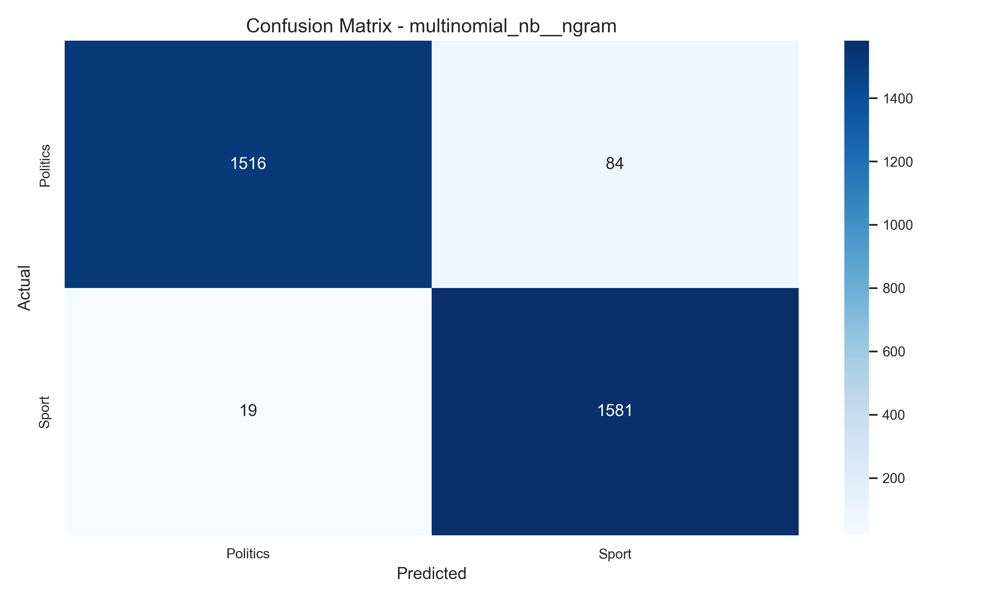
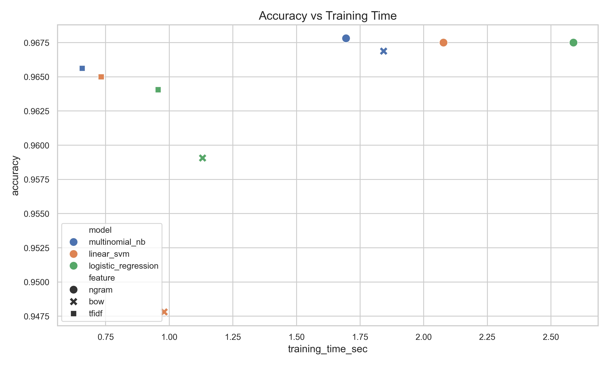
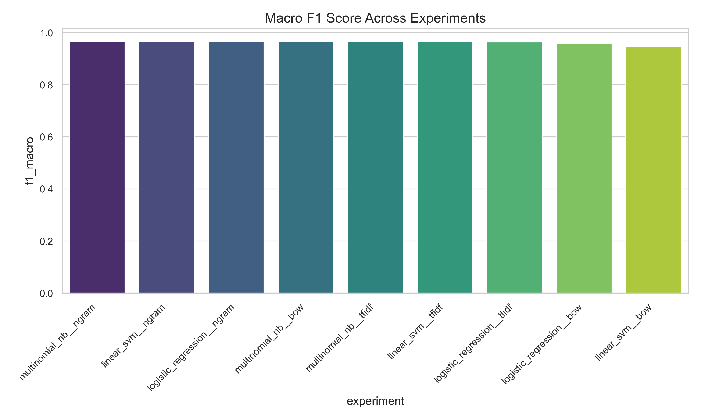

# Sports vs Politics Text Classification  
## Classical Machine Learning Approach

**Course:** Natural Language Processing  
**Student:** Shweta Mandal  
**Dataset:** AG News (Filtered: Sports vs Politics)  
**Samples:** 8000 per class (16000 total)

---

## Abstract

This report presents a detailed study of binary text classification for distinguishing between Sports and Politics news articles using classical machine learning techniques. While modern NLP research emphasizes transformer-based architectures, this project intentionally focuses on interpretable and computationally efficient linear models. Using a balanced subset of the AG News dataset, three feature extraction techniques — Bag of Words (BoW), TF-IDF, and n-grams (1,2) — were evaluated across three classifiers: Multinomial Naive Bayes, Logistic Regression, and Linear Support Vector Machines. Experimental results demonstrate that feature representation plays a more significant role than classifier choice. The best-performing model achieved an accuracy of 96.78% using n-gram features.

---

## 1. Problem Definition

Text classification is a foundational task in Natural Language Processing (NLP), where the objective is to assign predefined categories to text documents.

The problem addressed in this assignment is binary classification between:

- **Sports**
- **Politics**

Given a news article, the model must correctly identify its category.

Although these domains are generally distinct, real-world articles may contain overlapping vocabulary such as:

- “national team”
- “government funding”
- “election committee”
- “Olympic policy”

Thus, the classification task requires models capable of capturing domain-specific lexical patterns.

---

## 2. Data Source & Labeling

The dataset was constructed from the AG News dataset using the HuggingFace `datasets` library.

From the original four categories, two were selected:

- **World → Treated as Politics**
- **Sports**

### Dataset Configuration

- 8000 samples per class
- Total: 16000 samples
- Balanced dataset
- 80–20 stratified train-test split
- Random seed fixed at 42

The balanced design ensures unbiased evaluation and comparable macro and weighted metrics.

---

## 3. Preprocessing

The preprocessing pipeline consisted of:

- Lowercasing text
- Removal of extra whitespace
- Tokenization handled via scikit-learn vectorizers
- No aggressive stopword removal (to preserve meaningful bigrams)
- No stemming or lemmatization

To avoid data leakage:

- Vectorizers were fitted only on training data.
- The same fitted transformers were applied to the test set.

Stratified splitting preserved class distribution in both training and testing sets.

---

## 4. Dataset Analysis

The dataset contains clearly domain-specific vocabulary:

### Sports Articles
Common terms include:
- match
- goal
- tournament
- league
- championship

### Politics Articles
Common terms include:
- government
- minister
- election
- policy
- parliament

However, contextual ambiguity exists in cases such as:
- “Government funds Olympic training”
- “Political controversy in sports federation”

This overlap motivates the use of contextual feature representations like n-grams.

---

## 5. Feature Engineering

Machine learning models require numerical feature representations. Three approaches were evaluated.

### 5.1 Bag of Words (BoW)

Represents documents as unigram frequency vectors:

d = [f(w₁,d), f(w₂,d), ..., f(wₙ,d)]

Limitation: Ignores word order and contextual relationships.

---

### 5.2 TF-IDF

TF-IDF reweights terms based on their corpus-level importance:

TF-IDF(t, d) = TF(t, d) × log(N / DF(t))

Where:
- TF(t, d): Term frequency in document d
- DF(t): Document frequency of term t
- N: Total number of documents

TF-IDF reduces the influence of very common words.

---

### 5.3 n-grams (1,2)

Includes both unigrams and bigrams.

Examples:
- prime minister
- world cup
- election campaign

This captures phrase-level context and significantly improves discrimination.

---

## 6. Model Comparison

Three classical classifiers were evaluated.

### 6.1 Multinomial Naive Bayes

- Probabilistic model
- Assumes feature independence
- Particularly suited for discrete word counts

---

### 6.2 Logistic Regression

- Linear classifier
- Optimizes log-loss
- Produces probabilistic predictions

---

### 6.3 Linear Support Vector Machine (SVM)

- Margin-based classifier
- Effective in high-dimensional sparse feature spaces
- Strong baseline for text classification

All models were implemented using scikit-learn.

---

## 7. Evaluation Protocol

The experimental setup included:

- Stratified 80–20 train-test split
- Random seed = 42
- 5-fold cross-validation
- Metrics:
  - Accuracy
  - Precision (macro & weighted)
  - Recall (macro & weighted)
  - F1-score (macro & weighted)

Macro and weighted scores were reported due to balanced dataset.

---

## 8. Results & Analysis

### Best Model Performance (8000 Samples)

| Model | Feature | Accuracy |
|--------|----------|----------|
| Multinomial NB | n-gram (1,2) | **96.78%** |
| Linear SVM | n-gram (1,2) | 96.75% |
| Logistic Regression | n-gram (1,2) | 96.75% |

---

### Confusion Matrix



The confusion matrix shows strong diagonal dominance, indicating minimal cross-domain misclassification.

---

### Accuracy vs Training Time



Linear models show minor accuracy differences but varying computational costs.

---

### Feature Comparison (Macro F1)



n-gram features consistently outperform BoW and TF-IDF across all classifiers.

---

### Key Observations

- Feature representation influences performance more than classifier choice.
- n-grams provide the strongest discrimination.
- BoW performs worst across models.
- Performance converges as dataset size increases.
- Macro and weighted F1 scores are nearly identical, confirming balanced evaluation.

---

## 9. Discussion

The experiments highlight that classical linear models remain highly competitive for domain-specific classification tasks.

The inclusion of bigrams enables capture of meaningful phrases such as:

- “prime minister”
- “world cup”

With increasing dataset size, Naive Bayes becomes increasingly competitive due to improved probability estimation.

The minimal performance gap among linear classifiers suggests near-linear separability in the n-gram feature space.

---

## 10. Limitations

Despite strong performance, limitations remain:

1. Only classical ML models were evaluated.
2. No deep learning baselines (e.g., BERT).
3. Binary classification simplifies real-world complexity.
4. No extensive hyperparameter tuning.
5. Static evaluation based on a single split.

Future work could include transformer-based models and multi-class experiments.

---

## 11. Reproducibility

The entire pipeline is fully reproducible.

To regenerate results:

```bash
pip install -r requirements.txt
python src/generate_raw_data.py
python src/prepare_dataset.py
python src/train_models.py
python src/generate_plots.py
