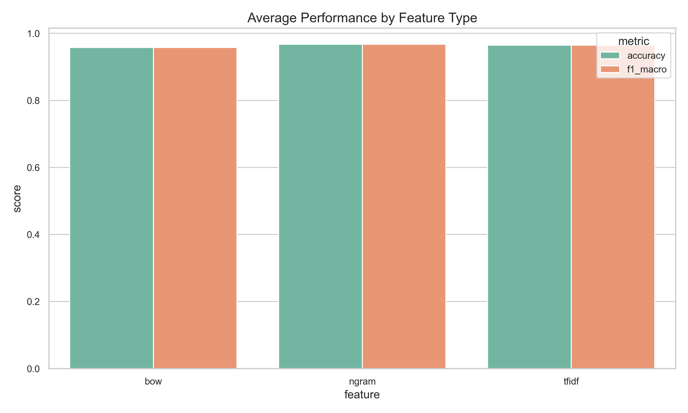
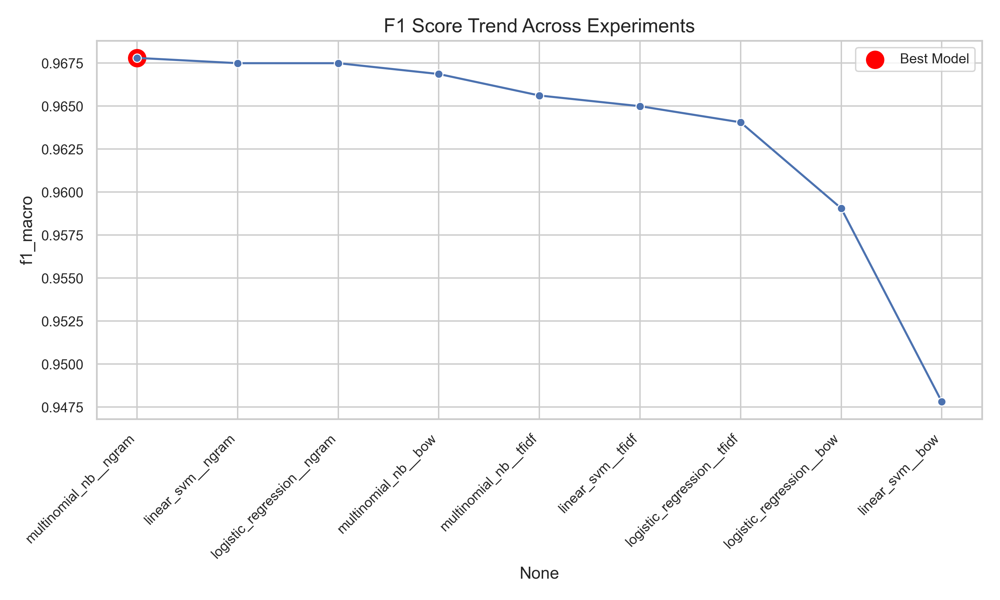

# Sports vs Politics: Problem 4 

---

## 1. Problem Statement

The objective of this project is to build and compare multiple machine learning models for binary text classification.

Given a news article, the system must automatically classify it into one of two categories:

- **Politics**
- **Sport**

The task evaluates the effectiveness of different feature representations and classification algorithms in distinguishing between domain-specific news content.

The goal is not only to achieve high performance, but also to compare modeling approaches systematically and analyze their behavior.

---

## 2. Data Source & Labeling

### 2.1 Data Sources
The dataset was constructed from the AG News dataset using the HuggingFace `datasets` library.

From the original four categories, two were selected:

- **World (treated as Politics):** 
The AG News dataset does not contain an explicit “Politics” category. Therefore, the “World” category was used as a proxy for political content. While World includes some non-political international stories, it predominantly covers geopolitical and governmental topics, making it a reasonable approximation for this task.
- **Sports**

### 2.2 Dataset Configuration

- 8000 samples per class
- Total: 16000 samples
- Balanced dataset
- 80–20 stratified train-test split

The balanced design ensures unbiased evaluation and comparable macro and weighted metrics.

---

## 3. Preprocessing

The preprocessing pipeline focused on structured dataset preparation rather than heavy linguistic normalization.

### 3.1 Data Loading

Raw text files were stored in:

- `data/raw/politics`
- `data/raw/sport`

Each `.txt` file was read (Latin-1 encoding) and converted into a structured format containing:

- `text`: article content  
- `label`: corresponding category (Politics or Sport)

All documents were combined into a single dataset and shuffled using a fixed random seed (`RANDOM_STATE = 42`) to eliminate ordering bias.

The complete dataset was saved as:
```bash
data/processed/complete_dataset.csv
```
### 3.2 Train Test Split

The dataset was split using following stratified split:

- Training data: 80%
- Testing data: 20%

To avoid data leakage:

- Vectorizers were fitted only on training data.
- The same fitted transformers were applied to the test set.

Stratified splitting preserved class distribution in both training and testing sets.

---

## 4. Dataset Analysis

The dataset contains clearly domain-specific vocabulary:

### Sports Articles
Common terms include:
- match
- goal
- tournament
- league
- championship

### Politics Articles
Common terms include:
- government
- minister
- election
- policy
- parliament

However, contextual ambiguity exists in cases such as:
- “Government funds Olympic training”
- “Political controversy in sports federation”

This overlap motivates the use of contextual feature representations like n-grams.

---

## 5. Feature Engineering

Machine learning models require numerical feature representations. Three approaches were evaluated.

### 5.1 Bag of Words (BoW)

Represents documents as unigram frequency vectors:

d = [f(w₁,d), f(w₂,d), ..., f(wₙ,d)]

Limitation: Ignores word order and contextual relationships.


### 5.2 TF-IDF

TF-IDF reweights terms based on their corpus-level importance:

TF-IDF(t, d) = TF(t, d) × log(N / DF(t))

Where:
- TF(t, d): Term frequency in document d
- DF(t): Document frequency of term t
- N: Total number of documents

TF-IDF reduces the influence of very common words.


### 5.3 n-grams 

Includes both unigrams and bigrams.

Examples:
- prime minister
- world cup
- election campaign

This captures phrase-level context and significantly improves discrimination.

---

## 6. Model Comparison

Three classical classifiers were evaluated.

### 6.1 Multinomial Naive Bayes

- Probabilistic model
- Assumes feature independence
- Particularly suited for discrete word counts


### 6.2 Logistic Regression

- Linear classifier
- Optimizes log-loss
- Produces probabilistic predictions


### 6.3 Linear Support Vector Machine (SVM)

- Margin-based classifier
- Effective in high-dimensional sparse feature spaces
- Strong baseline for text classification

Total number of experiments is 9 (3 models x 3 features). All models were implemented using scikit-learn. 

---

## 7. Evaluation Protocol

The experimental setup included:

### 7.1 Metrics Used

Metrics used to evaluate each model's performance are:

  - Accuracy
  - Precision (macro & weighted)
  - Recall (macro & weighted)
  - F1-score (macro & weighted)

### 7.2 Outputs

All the results were stored in results/ folder.

---

## 8. Quantitative Comparisons

This section presents a detailed quantitative comparison across feature representations and classifiers using test-set metrics and cross-validation results.

### 8.1 Overall Performance Comparison

The best-performing configuration was:

- **Multinomial Naive Bayes + n-gram (1,2)**
- Accuracy: **96.78%**
- Macro F1: **0.9678**

Closely following were:

- Linear SVM + n-gram → 96.75% accuracy
- Logistic Regression + n-gram → 96.75% accuracy

The maximum difference between the top three models is only **0.03%**, indicating strong convergence among linear classifiers when n-gram features are used.


### 8.2 Feature-Level Comparison

Average accuracy trends across feature types:

| Feature | Accuracy Range |
|----------|----------------|
| n-gram (1,2) | 96.75% – 96.78% |
| TF-IDF | 96.41% – 96.50% |
| BoW | 94.78% – 96.69% |

Observations:

- n-gram features consistently outperform both BoW and TF-IDF.
- BoW shows the weakest performance overall.
- Performance gap between n-gram and BoW reaches nearly **2%** in the case of Linear SVM (96.75% vs 94.78%).

This confirms that contextual phrase information significantly improves classification performance.



### 8.3 Classifier-Level Comparison

Across feature types:

- Multinomial Naive Bayes shows strong performance, particularly with n-grams because with a sufficiently large dataset, probability estimates stabilizes.
- Linear SVM and Logistic Regression exhibit nearly identical performance.

The smallest performance variance is observed among linear classifiers using n-grams, suggesting near-linear separability in the feature space.

### 8.4 Per-Class Performance Analysis

For the best model (Multinomial NB + n-gram):

- Politics F1-score: **0.9671**
- Sport F1-score: **0.9685**




### 8.5 Confusion matrix 

Confusion matrix for best model (Multinomial NB + n-gram):
- Politics correctly classified: 1516 / 1600
- Sport correctly classified: 1581 / 1600
- Total misclassifications: 103 out of 3200

The model shows slightly higher recall for the Sport class.


### 8.6 Cross-Validation Comparison

Cross-validation macro F1 scores:

| Model + Feature | CV Macro F1 |
|-----------------|-------------|
| Linear SVM + n-gram | 0.9683 |
| Logistic Regression + n-gram | 0.9666 |
| Multinomial NB + n-gram | 0.9665 |

Cross-validation results are consistent with test-set results, indicating stable generalization and minimal overfitting.

### 8.7 Key Quantitative Insights

1. n-gram features provide the largest performance improvement (~1–2% over BoW).
2. Differences between top three models are statistically minimal.
3. Cross-validation confirms stability.
4. The dataset appears nearly linearly separable in n-gram feature space.
5. Feature engineering has a larger impact than classifier selection.

---

## 9. Discussion

- Multinomial Naive Bayes performed slightly better due to strong class-specific word distributions and stabilized probability estimates from the large dataset.
- The minimal accuracy difference (<0.1%) among Naive Bayes, Logistic Regression, and SVM suggests near-linear separability in the n-gram feature space.
- n-gram features had the greatest impact on performance, outperforming BoW and TF-IDF by up to ~2%, indicating the importance of phrase-level context.

---

## 10. Limitations

Despite strong performance, limitations remain:

1. Binary classification (Sports vs Politics) simplifies the problem; real-world news classification is typically multi-class and more complex.
2. Evaluation was conducted on a single stratified split; repeated random splits could provide stronger statistical confidence.
3. The dataset is derived from a single source (AG News), which limits generalization to other news domains or writing styles.
4. No extensive hyperparameter tuning.
5. Classical linear models were evaluated, but no neural or transformer-based baselines were included for comparison.


---
## 11. Reproducibility

The entire pipeline is easily reproducible.

### 11.1 Commands:

```bash
pip install -r requirements.txt
python src/generate_raw_data.py
python src/prepare_dataset.py
python src/train_models.py
python src/generate_plots.py
```


